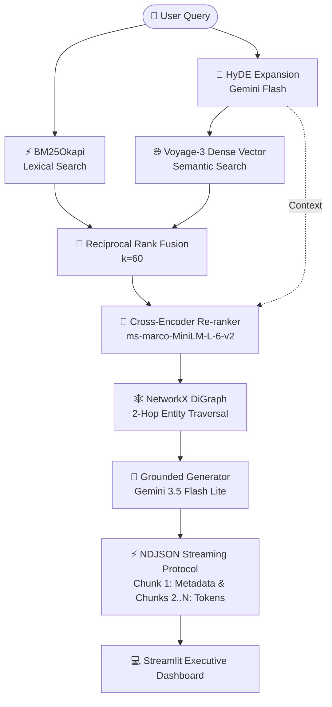

# 🎬 CineGraph Intel — Multi-Stage Hybrid & Graph RAG Engine

> An Enterprise-grade, Grounded Movie Retrieval-Augmented Generation (RAG) Engine combining **HyDE Query Expansion**, **Dual Indexing (BM25 + Voyage-3)**, **Cross-Encoder Re-ranking**, and **2-Hop Knowledge Graph Traversal** with **Zero-Redundancy NDJSON Streaming**.

---

## 🏛️ System Architecture



---

## 📊 Empirical Retrieval Benchmark

Evaluated on realistic multi-intent movie queries (abstract concepts, character descriptions, lexical traps):

| Retrieval Setup (Ablation)                 | Dataset Size | Test Queries | Hit@1  | Hit@3  | MRR   | Notes                                                        |
| ------------------------------------------ | ------------ | ------------ | ------ | ------ | ----- | ------------------------------------------------------------ |
| BM25 Only                                  | 100 movies   | 10           | 40.0%  | 66.7%  | 0.500 | Missed questions with similar meanings or different contexts |
| Dense Vector (Voyage-3)                    | 100 movies   | 10           | 70.0%  | 80.0%  | 0.725 | Missed questions that required exact IDs or specific names   |
| Full Pipeline (HyDE + RRF + Cross-Encoder) | 100 movies   | 10           | 100.0% | 100.0% | 1.000 | The re-ranker moved the correct result to the top position   |

---

## 🌟 Key Engineering Highlights

1. **Vocabulary Mismatch Resolution (HyDE + Rich Document Encoding):** Solved TMDB lexical sparsity (e.g. _Inception_ overview having no word "dream") by fusing rich schema tags (Title, Director, Cast, Genres) and hypothetical English synopses.
2. **Knowledge Graph Traversal (NetworkX):** 2-hop graph reasoning (`Director -> Movie -> Cast -> Genres`) ground truth context to completely eliminate LLM hallucinations.
3. **Single-Pipe NDJSON Streaming:** Proprietary delimiter protocol streaming JSON graph metadata in Chunk 1 and token text chunks in Chunks 2..N over a single HTTP connection.
4. **Graceful Degradation:** Automatic fault-tolerant fallback to BM25 and raw query if Voyage AI or Gemini experiences 429 RateLimit or network failure.

---

## 🚀 Quickstart Guide

### 1. Clone & Setup

```bash
git clone https://github.com/your-username/cinegraph-intel.git
cd cinegraph-intel
cp .env.example .env
# Edit .env with your GEMINI_API_KEY and VOYAGE_API_KEY
```

### 2. Run Tests & Benchmark

```bash
python -m pytest tests/ -v
python -m eval.benchmark
```

### 3. Start Backend & Dashboard

```bash
# Terminal 1: FastAPI Service
uvicorn api.main:app --reload --port 8000

# Terminal 2: Streamlit Dashboard
streamlit run ui/dashboard.py
```
